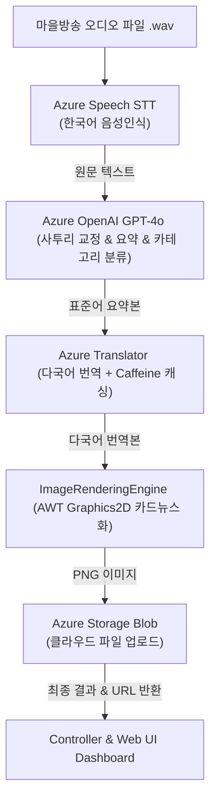

# 🎙️ AI Cast System (Spring Boot v1.0)

[](https://spring.io/projects/spring-boot)
[](https://jdk.java.net/)
[](#)

AI Cast는 **다국어 마을방송 통합 파이프라인 솔루션**입니다.
사투리나 부정확한 독음이 섞인 고령층/현지 주민의 음성 방송 데이터를 입력받아 **음성 인식(STT) → 사투리 표준어 정제 및 요약(NLP) → 다국어 번역(Translation) → 카드뉴스 자동 생성(Image Rendering) → 클라우드 업로드(Blob Storage)** 과정을 거쳐 외국인 주민을 위한 번역 방송 및 다국어 알림 이미지를 일괄 생산하고 모니터링할 수 있는 차세대 스마트 공공 정보 전파 시스템입니다.

---

## 🏗️ 아키텍처 및 데이터 파이프라인

AI Cast의 유기적 프로세스 구조는 아래와 같습니다.



---

## ✨ 핵심 기능

1. **지능형 다국어 파이프라인 (`/api/pipeline/process`)**
   * **STT (Speech-to-Text)**: 구어체 및 소음이 섞인 한국어 음성 파일을 텍스트로 인식합니다.
   * **NLP 정제 및 요약**: 사투리 및 구어체 발음을 격식 있는 표준어로 윤문 및 요약하며, 방송 주제에 맞춰 카테고리(재난, 일반 공지, 건강, 행정 등)를 지능적으로 분류합니다.
   * **다국어 캐싱 번역**: 다국어 번역 시 로컬 메모리 캐시(Caffeine Cache)를 경유해 반복 번역에 따른 과금과 레이턴시를 최소화합니다.
   * **이미지 자동 생성**: 번역본 요약문을 800x800 해상도의 고품질 이미지 카드로 그리며, 카테고리에 맞는 전용 그라데이션 테마(예: 폭염/태풍은 적색/황색, 건강/생활은 녹색/블루)를 동적으로 디자인합니다.
2. **실시간 모니터링 및 장애 감지**
   * **Slack Alert**: API 에러 임계치 초과 또는 서버 리소스(CPU, Memory) 경고 감지 시 즉시 슬랙 알림을 전송합니다.
   * **Resource Logger**: DB 테이블(`TbResLog`)에 주기적으로 CPU/메모리 사용률을 모니터링하여 로그를 보관합니다.
3. **직관적인 모니터링 웹 대시보드**
   * `/dashboard`: 최신 방송 처리 현황(STT 텍스트, 다국어 번역본, 생성 이미지 카드 목록)을 실시간으로 확인합니다.
   * `/stats`: 일별/월별 API 호출 통계 및 자격증명/리소스 요약 상태를 시각화합니다.

---

## ⚙️ 기술 스택 (Tech Stack)

* **Backend Framework**: Spring Boot 3.2.4
* **AI & Integration**: Spring AI (Azure OpenAI Chat), Azure Speech SDK, Azure Storage Blob SDK
* **Database & Persistence**: Spring Data JPA, MariaDB
* **Caching**: Caffeine Cache (Local Memory Cache)
* **View Engine**: Thymeleaf (HTML5 / Vanilla CSS)
* **Build Tool**: Maven (Java 17)

---

## 🔑 환경 설정 (Configuration)

애플리케이션 구동을 위해서는 Azure 클라우드 서비스 자격증명이 필요합니다. 
[docs/80_RawData/aicast_env_config.template.txt](file:///e:/%EB%AA%A8%EB%B9%8C%EB%A6%AC%ED%8B%B0%EC%82%AC%EC%97%85%EB%B3%B8%EB%B6%80/%ED%94%84%EB%A1%9C%EC%A0%9D%ED%8A%B8/2026/vibe%20coding/workspace/AI_Cast/docs/80_RawData/aicast_env_config.template.txt) 파일을 복사하여 `aicast_env_config.txt`를 생성하고 실제 키를 채워 주십시오.

```ini
# Azure Speech (STT)
AZURE_SPEECH_KEY=YOUR_AZURE_SPEECH_KEY
AZURE_SPEECH_REGION=koreacentral

# Azure OpenAI (GPT-4o)
AZURE_OPENAI_KEY=YOUR_AZURE_OPENAI_KEY
AZURE_OPENAI_ENDPOINT=https://aoai-aicast-dev.openai.azure.com/openai/v1
AZURE_OPENAI_DEPLOYMENT_NAME=gpt-4o

# Azure Translator (번역)
AZURE_TRANSLATOR_KEY=YOUR_AZURE_TRANSLATOR_KEY
AZURE_TRANSLATOR_REGION=koreacentral
```

---

## 🚀 실행 및 테스트

### 1. 로컬 환경에서 실행
```bash
# 빌드 및 구동
mvn spring-boot:run
```

### 2. 통합 검증 테스트 실행
로컬의 실제 키 설정을 바탕으로 파이프라인의 입출력 전 과정을 시뮬레이션하고 검증할 수 있는 통합 테스트 스크립트입니다.
```powershell
# E2E 통합 테스트 수행 (PowerShell)
.\run_e2e_test.ps1
```

### 3. API 요청 규격 예시
```bash
curl -X POST http://localhost:8080/api/pipeline/process \
  -H "X-API-KEY: YOUR_API_KEY_HERE" \
  -F "file=@village_broadcast_sample.wav" \
  -F "targetLanguages=en,ja,vi" \
  -F "correlationId=corr-req-12345"
```

---

## 🐳 Docker 배포 가이드

본 애플리케이션은 경량 Alpine 리눅스를 탑재한 멀티 스테이지 컨테이너 이미지로 배포 가능합니다.

```bash
# Docker 이미지 빌드
docker build -t aicast:1.0.0 .

# 컨테이너 실행 (자격증명 환경 변수 로드 후 시작)
docker run -d --name aicast-server \
  -p 8080:8080 \
  --env-file ./docs/80_RawData/aicast_env_config.txt \
  aicast:1.0.0
```