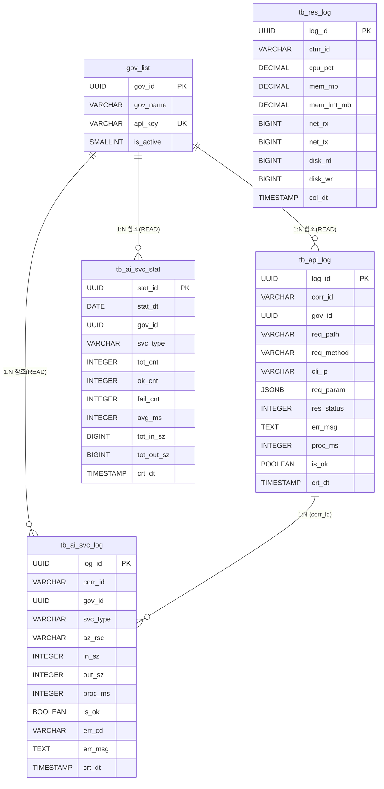

# DB 스키마 설계서 (API 로그, 통계 및 리소스 모니터링)

본 문서는 AI Cast 시스템의 AI 서비스 호출 로그 기록, 통계 구축 및 컨테이너 리소스 모니터링을 위한 데이터베이스 스키마 설계서입니다.

## 1. DB 접속 정보

| 항목 | 값 |
|:---|:---|
| Server Host | `211.248.161.43` |
| Database | `ai_smartcast` |
| Username | `ai_aventusm` |
| Port | `43306` |
| Password | 별도 관리 (`10_Reference/DB_connectionInfo.md` 참조) |

## 2. 설계 목표
- **추적성**: Correlation ID 기반 전 과정 추적 (NF-03).
- **AI 호출 분석**: Azure AI 서비스(STT, NLP, TRANSLATE, OCR, IMAGE_GENERATION) 호출 로그 저장 및 통계 집계 (F-09~F-11).
- **운영 가시성**: 컨테이너 리소스 사용량 수집 및 실시간 모니터링 (F-14~F-16).

## 3. 외부 참조 테이블

### 3.1. 지자체 관리 테이블 (`gov_list`) — 참조 전용

> **본 테이블은 기존 DB에 이미 존재하는 테이블이며, AI Cast 시스템에서는 READ(조회)만 수행합니다. 생성/수정 대상이 아닙니다.**

| 컬럼명 | 타입 | 설명 | 비고 |
|:---|:---|:---|:---|
| `gov_id` | UUID | 고유 식별자 (PK) | |
| `gov_name` | VARCHAR(100) | 지자체명 | |
| `api_key` | VARCHAR(255) | API 연동 키 (UNIQUE) | F-07 인증 조회용 |
| `is_active` | SMALLINT | 활성화 여부 (1=활성) | F-08 유효성 검사 |

- **인증 로직**: `api_key` 존재 + `is_active = 1` → 유효 (F-06~F-08)
- **관리자 판별**: 별도 관리자 키 목록 또는 `gov_list` 확장 여부는 운영 정책에 따름 (F-13)

---

## 4. 신규 생성 테이블

### 4.1. API 호출 로그 테이블 (`tb_api_log`)

외부 API 호출 시 발생하는 요청/응답 내역을 기록합니다.

| 컬럼명 | 타입 | 제약조건 | 설명 | 요구사항 |
|:---|:---|:---|:---|:---:|
| `log_id` | UUID | PRIMARY KEY | 로그 고유 ID | |
| `corr_id` | VARCHAR(64) | NOT NULL | Correlation ID (요청 추적) | NF-03 |
| `gov_id` | UUID | NOT NULL | 호출자 지자체 ID (gov_list 참조) | F-10 |
| `req_path` | VARCHAR(255) | NOT NULL | API 경로 (`/api/process_audio` 등) | |
| `req_method` | VARCHAR(10) | NOT NULL | HTTP Method (POST, GET 등) | |
| `cli_ip` | VARCHAR(45) | | 호출자 IP | |
| `req_param` | JSONB | | 요청 파라미터 (민감정보 제외) | |
| `res_status` | INTEGER | NOT NULL | HTTP 응답 코드 (200, 400 등) | |
| `err_msg` | TEXT | | 오류 상세 메시지 | NF-05 |
| `proc_ms` | INTEGER | | 전체 처리 소요시간 (ms) | NF-01 |
| `is_ok` | BOOLEAN | DEFAULT TRUE | 성공 여부 | F-17 |
| `crt_dt` | TIMESTAMP | DEFAULT CURRENT_TIMESTAMP | 호출 일시 | |

### 4.2. AI 서비스 호출 로그 테이블 (`tb_ai_svc_log`)

파이프라인 내부 Azure AI 서비스 단계별 호출 로그를 기록합니다 (F-09, F-10).

| 컬럼명 | 타입 | 제약조건 | 설명 | 요구사항 |
|:---|:---|:---|:---|:---:|
| `log_id` | UUID | PRIMARY KEY | 로그 고유 ID | |
| `corr_id` | VARCHAR(64) | NOT NULL | tb_api_log와 연결 추적 ID | NF-03 |
| `gov_id` | UUID | NOT NULL | 호출자 지자체 ID | F-10 |
| `svc_type` | VARCHAR(30) | NOT NULL | 서비스 유형 (STT, NLP, TRANSLATE, IMAGE_GEN, OCR) | F-09 |
| `az_rsc` | VARCHAR(50) | | 사용된 Azure 리소스명 | |
| `in_sz` | INTEGER | | 입력 크기 (바이트/토큰/문자) | |
| `out_sz` | INTEGER | | 출력 크기 | |
| `proc_ms` | INTEGER | | 단계 처리 소요시간 (ms) | NF-01 |
| `is_ok` | BOOLEAN | DEFAULT TRUE | 성공 여부 | |
| `err_cd` | VARCHAR(20) | | 오류 코드 | |
| `err_msg` | TEXT | | 오류 상세 메시지 | NF-05 |
| `crt_dt` | TIMESTAMP | DEFAULT CURRENT_TIMESTAMP | 호출 일시 | |

> **추적 관계**: 하나의 `corr_id`로 `tb_api_log` 1건 + `tb_ai_svc_log` N건이 연결됩니다.

### 4.3. AI 서비스 일별 통계 테이블 (`tb_ai_svc_stat`)

매일 00:10에 전일 `tb_ai_svc_log`를 집계하여 저장합니다 (F-11).

| 컬럼명 | 타입 | 제약조건 | 설명 | 요구사항 |
|:---|:---|:---|:---|:---:|
| `stat_id` | UUID | PRIMARY KEY | 통계 고유 ID | |
| `stat_dt` | DATE | NOT NULL | 통계 대상 날짜 | F-11 |
| `gov_id` | UUID | NOT NULL | 호출자 지자체 ID | F-10 |
| `svc_type` | VARCHAR(30) | NOT NULL | 서비스 유형 | F-09 |
| `tot_cnt` | INTEGER | DEFAULT 0 | 총 호출 수 | |
| `ok_cnt` | INTEGER | DEFAULT 0 | 성공 수 | |
| `fail_cnt` | INTEGER | DEFAULT 0 | 실패 수 | |
| `avg_ms` | INTEGER | | 평균 처리시간 (ms) | |
| `tot_in_sz` | BIGINT | DEFAULT 0 | 총 입력 크기 | |
| `tot_out_sz` | BIGINT | DEFAULT 0 | 총 출력 크기 | |
| `crt_dt` | TIMESTAMP | DEFAULT CURRENT_TIMESTAMP | 집계 일시 | |

> **복합 유니크**: `(stat_dt, gov_id, svc_type)` 조합은 유니크해야 합니다.
> **주별/월별 통계**: 별도 테이블 없이 `stat_dt` 범위 쿼리로 실시간 조회합니다 (F-11).

### 4.4. 컨테이너 리소스 모니터링 테이블 (`tb_res_log`)

컨테이너의 리소스 사용량을 주기적으로 수집·저장합니다 (F-14~F-16).

| 컬럼명 | 타입 | 제약조건 | 설명 | 요구사항 |
|:---|:---|:---|:---|:---:|
| `log_id` | UUID | PRIMARY KEY | 로그 고유 ID | |
| `ctnr_id` | VARCHAR(100) | NOT NULL | 컨테이너 식별자 | F-14 |
| `cpu_pct` | DECIMAL(5,2) | | CPU 사용률 (%) | F-14 |
| `mem_mb` | DECIMAL(10,2) | | 메모리 사용량 (MB) | F-14 |
| `mem_lmt_mb` | DECIMAL(10,2) | | 메모리 할당 한도 (MB) | F-14 |
| `net_rx` | BIGINT | | 네트워크 수신 (bytes) | F-14 |
| `net_tx` | BIGINT | | 네트워크 송신 (bytes) | F-14 |
| `disk_rd` | BIGINT | | 디스크 읽기 (bytes) | F-14 |
| `disk_wr` | BIGINT | | 디스크 쓰기 (bytes) | F-14 |
| `col_dt` | TIMESTAMP | DEFAULT CURRENT_TIMESTAMP | 수집 시각 | |

> **수집 정책**: 5초 간격 수집, 1시간분 데이터만 보존 (F-15). 1시간 초과 데이터는 자동 삭제.

---

## 5. 통계 뷰 및 집계 쿼리

### 5.1. 일별 통계 집계 쿼리 (F-11)

매일 00:10 실행되는 스케줄러가 사용하는 집계 쿼리입니다.

```sql
INSERT INTO tb_ai_svc_stat 
    (stat_id, stat_dt, gov_id, svc_type, tot_cnt, ok_cnt, 
     fail_cnt, avg_ms, tot_in_sz, tot_out_sz)
SELECT 
    gen_random_uuid(),
    CAST(:yesterday AS DATE),
    gov_id,
    svc_type,
    COUNT(*),
    COUNT(CASE WHEN is_ok = TRUE THEN 1 END),
    COUNT(CASE WHEN is_ok = FALSE THEN 1 END),
    AVG(proc_ms),
    SUM(COALESCE(in_sz, 0)),
    SUM(COALESCE(out_sz, 0))
FROM tb_ai_svc_log
WHERE CAST(crt_dt AS DATE) = CAST(:yesterday AS DATE)
GROUP BY gov_id, svc_type;
```

### 5.2. 호출자별 통계 조회 뷰 (`v_api_stat`)

API 사용 현황 대시보드 (F-17) 데이터를 제공합니다.

```sql
CREATE OR REPLACE VIEW v_api_stat AS
SELECT
    gl.gov_id,
    gl.gov_name,
    al.req_path,
    CAST(al.crt_dt AS DATE) AS call_dt,
    COUNT(*) AS tot_cnt,
    COUNT(CASE WHEN al.is_ok = TRUE THEN 1 END) AS ok_cnt,
    COUNT(CASE WHEN al.is_ok = FALSE THEN 1 END) AS fail_cnt,
    ROUND(
        COUNT(CASE WHEN al.is_ok = TRUE THEN 1 END) * 100.0 / COUNT(*), 2
    ) AS ok_rate,
    AVG(al.proc_ms) AS avg_ms
FROM tb_api_log al
JOIN gov_list gl ON al.gov_id = gl.gov_id
GROUP BY gl.gov_id, gl.gov_name, al.req_path, CAST(al.crt_dt AS DATE);
```

### 5.3. 주별/월별 통계 조회 쿼리 예시 (F-12)

```sql
-- 주별 조회
SELECT svc_type, SUM(tot_cnt), SUM(ok_cnt), SUM(fail_cnt)
FROM tb_ai_svc_stat
WHERE gov_id = :govId
  AND stat_dt BETWEEN :weekStart AND :weekEnd
GROUP BY svc_type;

-- 월별 조회
SELECT svc_type, SUM(tot_cnt), SUM(ok_cnt), SUM(fail_cnt)
FROM tb_ai_svc_stat
WHERE gov_id = :govId
  AND stat_dt BETWEEN :monthStart AND :monthEnd
GROUP BY svc_type;
```

### 5.4. 리소스 요약 쿼리

```sql
SELECT
    ctnr_id,
    AVG(cpu_pct) AS avg_cpu,
    MAX(cpu_pct) AS peak_cpu,
    AVG(mem_mb) AS avg_mem,
    MAX(mem_mb) AS peak_mem
FROM tb_res_log
WHERE col_dt >= NOW() - INTERVAL '1 HOUR'
GROUP BY ctnr_id;
```

---

## 6. 인덱스 설계

### 6.1. `tb_api_log` 인덱스
| 인덱스명 | 대상 컬럼 | 용도 |
|:---|:---|:---|
| `idx_al_crt_dt` | `crt_dt` | 날짜별 검색 및 통계 집계 |
| `idx_al_gov_id` | `gov_id` | 호출자별 이력 조회 (F-10) |
| `idx_al_corr_id` | `corr_id` | 전 과정 추적 조회 (NF-03) |
| `idx_al_is_ok` | `is_ok` | 성공/실패 필터링 (F-17) |

### 6.2. `tb_ai_svc_log` 인덱스
| 인덱스명 | 대상 컬럼 | 용도 |
|:---|:---|:---|
| `idx_sl_crt_dt` | `crt_dt` | 일별 통계 집계 대상 조회 (F-11) |
| `idx_sl_corr_id` | `corr_id` | 파이프라인 추적 (NF-03) |
| `idx_sl_gov_svc` | `gov_id, svc_type` | 호출자+서비스별 조회 (F-09, F-10) |

### 6.3. `tb_ai_svc_stat` 인덱스
| 인덱스명 | 대상 컬럼 | 용도 |
|:---|:---|:---|
| `idx_st_stat_dt` | `stat_dt` | 일별/주별/월별 통계 조회 (F-12) |
| `uq_st_dt_gov_svc` | `stat_dt, gov_id, svc_type` | 중복 집계 방지 (UNIQUE) |

### 6.4. `tb_res_log` 인덱스
| 인덱스명 | 대상 컬럼 | 용도 |
|:---|:---|:---|
| `idx_rl_col_dt` | `col_dt` | 시계열 조회 및 1시간 보존 삭제 (F-15) |
| `idx_rl_ctnr_id` | `ctnr_id` | 컨테이너별 필터링 (F-14) |

---

## 7. ER 다이어그램



---

## 8. 테이블 약어 대조표

| 테이블 (약어) | 원래 명칭 | 설명 |
|:---|:---|:---|
| `gov_list` | Government List | 지자체 관리 (기존, 참조 전용) |
| `tb_api_log` | API Call Log | API 호출 로그 |
| `tb_ai_svc_log` | AI Service Log | AI 서비스 호출 로그 |
| `tb_ai_svc_stat` | AI Service Daily Stats | AI 서비스 일별 통계 |
| `tb_res_log` | Resource Log | 컨테이너 리소스 모니터링 |

### 컬럼 약어 대조표

| 약어 | 원래 명칭 | 사용 테이블 |
|:---|:---|:---|
| `corr_id` | correlation_id | tb_api_log, tb_ai_svc_log |
| `req_path` | request_path | tb_api_log |
| `req_method` | request_method | tb_api_log |
| `cli_ip` | client_ip | tb_api_log |
| `req_param` | request_params | tb_api_log |
| `res_status` | response_status | tb_api_log |
| `err_msg` | error_message | tb_api_log, tb_ai_svc_log |
| `proc_ms` | processing_time_ms | tb_api_log, tb_ai_svc_log |
| `is_ok` | is_success | tb_api_log, tb_ai_svc_log |
| `crt_dt` | created_at | 공통 |
| `svc_type` | service_type | tb_ai_svc_log, tb_ai_svc_stat |
| `az_rsc` | azure_resource | tb_ai_svc_log |
| `in_sz` | input_size | tb_ai_svc_log |
| `out_sz` | output_size | tb_ai_svc_log |
| `err_cd` | error_code | tb_ai_svc_log |
| `stat_dt` | stat_date | tb_ai_svc_stat |
| `tot_cnt` | total_count | tb_ai_svc_stat |
| `ok_cnt` | success_count | tb_ai_svc_stat |
| `fail_cnt` | failure_count | tb_ai_svc_stat |
| `avg_ms` | avg_processing_time_ms | tb_ai_svc_stat |
| `tot_in_sz` | total_input_size | tb_ai_svc_stat |
| `tot_out_sz` | total_output_size | tb_ai_svc_stat |
| `ctnr_id` | container_id | tb_res_log |
| `cpu_pct` | cpu_usage_percent | tb_res_log |
| `mem_mb` | memory_usage_mb | tb_res_log |
| `mem_lmt_mb` | memory_limit_mb | tb_res_log |
| `net_rx` | network_rx_bytes | tb_res_log |
| `net_tx` | network_tx_bytes | tb_res_log |
| `disk_rd` | disk_read_bytes | tb_res_log |
| `disk_wr` | disk_write_bytes | tb_res_log |
| `col_dt` | collected_at | tb_res_log |

---

## 9. 구현 제언 (Best Practices)

- **파티셔닝**: `tb_api_log`와 `tb_ai_svc_log`는 `crt_dt` 기준 **월별 파티셔닝**을 적용합니다.
- **비동기 로깅**: API Latency에 영향을 주지 않도록, 로그 저장은 비동기 처리합니다 (NF-01).
- **리소스 데이터 정리**: `tb_res_log`는 5초 간격 수집(F-15)으로 빠르게 증가하므로 **1시간 초과 자동 삭제** 스케줄러를 운영합니다.
- **통계 무결성**: `tb_ai_svc_stat`의 `(stat_dt, gov_id, svc_type)` 유니크 제약으로 중복 집계를 방지합니다.

---
**최종 업데이트**: 2026-05-12
**특이사항**: gov_list 참조 전용으로 변경 (생성 대상 아님), 테이블명/컬럼명 약어 적용, 약어 대조표 추가
