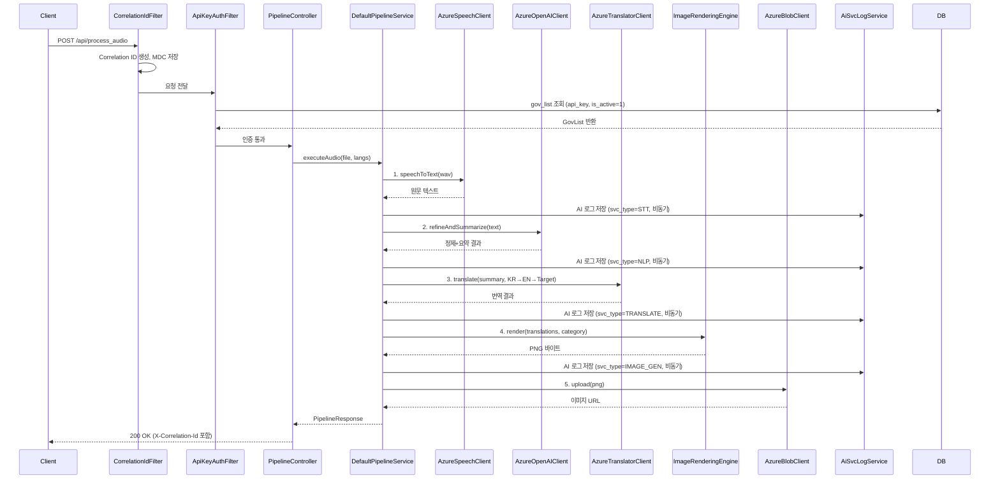
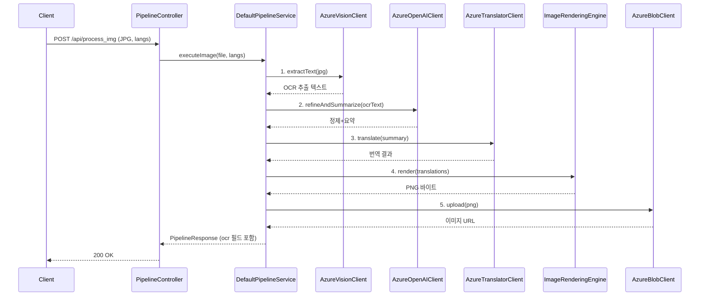
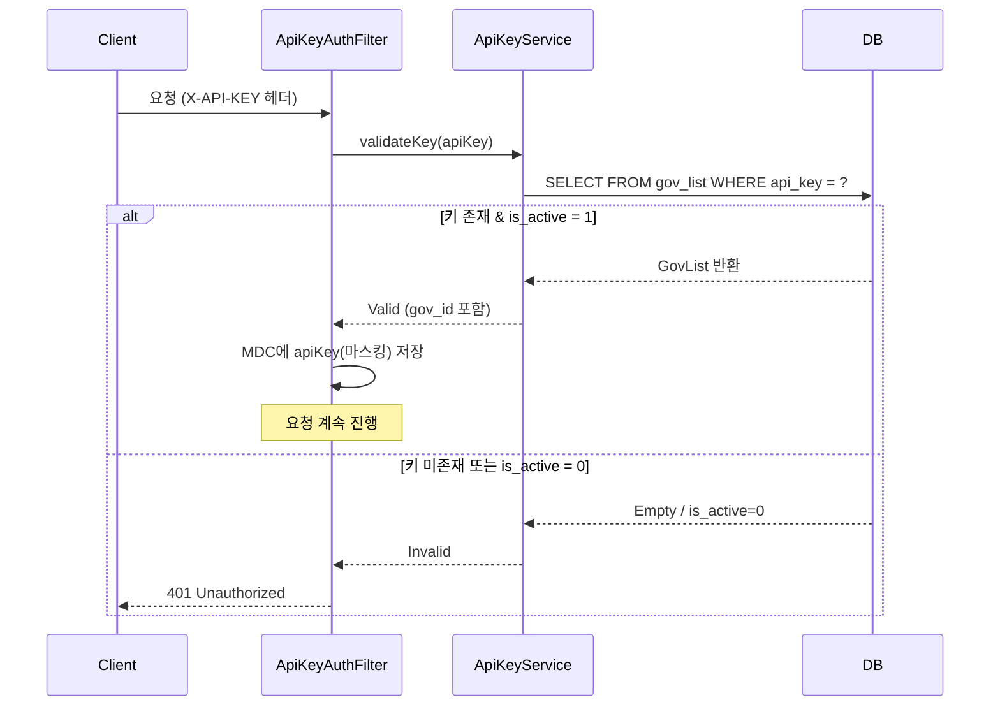

# 클래스 설계서 (Class Design)

본 문서는 AI Cast 시스템의 Java(Spring Boot) 기반 서버 아키텍처 및 상세 클래스 구조를 정의합니다.

## 1. 패키지 구조 (Package Structure)

```text
com.aicast.orchestrator
├── common                  # 공통 유틸리티, 상수, 예외
│   ├── filter              # Servlet Filter
│   │   ├── CorrelationIdFilter     # Correlation ID 생성/MDC 전파 (NF-03)
│   │   └── ApiKeyAuthFilter        # API Key 인증 Filter (F-06~F-08)
│   ├── aop                 # AOP
│   │   └── AiSvcLogAspect          # AI 서비스 호출 자동 로깅 (F-09, F-10)
│   ├── exception           # 예외 처리
│   │   ├── GlobalExceptionHandler  # 전역 예외 핸들러 (NF-05)
│   │   └── AzureServiceException   # Azure 서비스 예외
│   └── util                # 유틸리티
│       └── ApiKeyMasker            # API Key 마스킹 유틸
├── config                  # Spring 설정
│   ├── AsyncConfig                 # 비동기 처리 설정 (NF-01)
│   ├── AzureConfig                 # Azure SDK Bean 설정
│   ├── CacheConfig                 # Caffeine 캐시 설정 (F-25)
│   └── WebClientConfig             # WebClient 설정
├── controller              # API 엔드포인트
│   ├── PipelineController          # 파이프라인 API (API-01~05)
│   ├── StatsController             # 통계 API (API-06~08)
│   └── MonitorController           # 모니터링 API (API-09~10)
├── dto                     # 요청/응답 DTO
│   ├── request             # 요청 DTO
│   └── response            # 응답 DTO
├── service                 # 비즈니스 로직
│   ├── pipeline            # 파이프라인 오케스트레이션
│   │   ├── PipelineService (I)     # 파이프라인 인터페이스
│   │   └── DefaultPipelineService  # 파이프라인 구현체
│   ├── auth                # 인증
│   │   └── ApiKeyService           # API Key 유효성 검사
│   ├── log                 # 로그 및 통계
│   │   ├── ApiLogService           # API 호출 로그 관리
│   │   ├── AiSvcLogService         # AI 서비스 호출 로그 관리
│   │   └── StatsService            # 통계 집계 및 조회
│   ├── monitor             # 모니터링
│   │   └── ResourceMonitorService  # 컨테이너 리소스 수집 (F-14~F-16)
│   └── alert               # 알림
│       └── SlackAlertService       # Slack 장애 알림 (NF-05, F-16)
├── client                  # 외부 서비스 연동
│   ├── stt                 # Azure Speech SDK (F-18, F-19)
│   │   ├── SttClient (I)
│   │   └── AzureSpeechClient
│   ├── nlp                 # Azure OpenAI (F-20~F-22)
│   │   ├── NlpClient (I)
│   │   └── AzureOpenAIClient
│   ├── translate           # Azure Translator (F-23~F-25)
│   │   ├── TranslateClient (I)
│   │   └── AzureTranslatorClient
│   ├── ocr                 # Azure AI Vision (F-26~F-28)
│   │   ├── OcrClient (I)
│   │   └── AzureVisionClient
│   └── storage             # Azure Blob Storage (F-33, F-34)
│       ├── BlobClient (I)
│       └── AzureBlobClient
├── domain                  # JPA 엔티티
│   ├── GovList                     # 지자체 (참조 전용)
│   ├── TbApiLog                    # API 호출 로그
│   ├── TbAiSvcLog                  # AI 서비스 호출 로그
│   ├── TbAiSvcStat                 # AI 서비스 일별 통계
│   └── TbResLog                    # 컨테이너 리소스 로그
├── repository              # JPA Repository
│   ├── GovListRepository
│   ├── TbApiLogRepository
│   ├── TbAiSvcLogRepository
│   ├── TbAiSvcStatRepository
│   └── TbResLogRepository
└── engine                  # 이미지 렌더링 엔진
    ├── ImageRenderingEngine        # Graphics2D 렌더링 (F-29)
    ├── CategoryClassifier          # 카테고리 분류 (F-30)
    ├── ColorSchemeMapper           # 배경색 매핑 (F-31)
    └── FontManager                 # 다국어 폰트 관리 (F-32)
```

## 2. 핵심 클래스 관계도 (Class Diagram)

```mermaid
classDiagram
    direction TB

    %% Filter Layer
    class CorrelationIdFilter {
        +doFilter(req, res, chain)
    }
    class ApiKeyAuthFilter {
        -ApiKeyService apiKeyService
        +doFilter(req, res, chain)
    }

    %% Controller Layer
    class PipelineController {
        +ping() Response
        +getLatest() Response
        +processAudio(file, langs) Response
        +processText(file, langs) Response
        +processImg(file, langs) Response
    }
    class StatsController {
        +getDailyStats(params) Response
        +getWeeklyStats(params) Response
        +getMonthlyStats(params) Response
    }
    class MonitorController {
        +getResources(params) Response
        +getApiStatus(params) Response
    }

    %% Service Layer
    class PipelineService {
        <<interface>>
        +executeAudio(req) PipelineResponse
        +executeText(req) PipelineResponse
        +executeImage(req) PipelineResponse
    }
    class DefaultPipelineService {
        -SttClient sttClient
        -NlpClient nlpClient
        -TranslateClient translateClient
        -OcrClient ocrClient
        -ImageRenderingEngine engine
        -BlobClient blobClient
    }
    class ApiKeyService {
        +validateKey(apiKey) Boolean
        +identifyCaller(apiKey) GovList
    }
    class ApiLogService {
        +saveLog(TbApiLog) void
    }
    class AiSvcLogService {
        +saveLog(TbAiSvcLog) void
    }
    class StatsService {
        +aggregateDaily(date) void
        +getDailyStats(params) List
        +getWeeklyStats(params) List
        +getMonthlyStats(params) List
    }
    class ResourceMonitorService {
        +collectAndSave() void
        +getResources(params) List
    }
    class SlackAlertService {
        +sendAlert(level, msg, corrId) void
    }

    %% Client Layer
    class AzureSpeechClient {
        +speechToText(audioBytes) String
    }
    class AzureOpenAIClient {
        +refineAndSummarize(text) NlpResult
    }
    class AzureTranslatorClient {
        +translate(text, from, to) TranslateResult
    }
    class AzureVisionClient {
        +extractText(imageBytes) String
    }
    class AzureBlobClient {
        +upload(pngBytes, name) String
    }

    %% Engine Layer
    class ImageRenderingEngine {
        +render(text, category, lang) byte[]
    }
    class CategoryClassifier {
        +classify(text) Category
    }
    class FontManager {
        +getFont(langCode) Font
    }

    %% AOP
    class AiSvcLogAspect {
        +logAiServiceCall(joinPoint) Object
    }

    %% Relationships
    PipelineController --> PipelineService
    PipelineService <|.. DefaultPipelineService
    DefaultPipelineService --> AzureSpeechClient
    DefaultPipelineService --> AzureOpenAIClient
    DefaultPipelineService --> AzureTranslatorClient
    DefaultPipelineService --> AzureVisionClient
    DefaultPipelineService --> ImageRenderingEngine
    DefaultPipelineService --> AzureBlobClient

    StatsController --> StatsService
    MonitorController --> ResourceMonitorService
    MonitorController --> ApiLogService

    ApiKeyAuthFilter --> ApiKeyService
    ApiKeyService --> GovListRepository

    AiSvcLogAspect --> AiSvcLogService
    AiSvcLogService --> TbAiSvcLogRepository
    ApiLogService --> TbApiLogRepository
    StatsService --> TbAiSvcStatRepository
    ResourceMonitorService --> TbResLogRepository

    ImageRenderingEngine --> CategoryClassifier
    ImageRenderingEngine --> FontManager

    GlobalExceptionHandler --> SlackAlertService
```



## 3. 레이어별 주요 클래스 정보

### 3.1. Filter 레이어 (Common Layer)

| 클래스명 | 역할 | 요구사항 |
|:---|:---|:---:|
| `CorrelationIdFilter` | `X-Correlation-Id` 헤더 추출/생성, MDC 전파, 응답 헤더 포함 | NF-03 |
| `ApiKeyAuthFilter` | `X-API-KEY` 헤더 인증, gov_list 조회, is_active 확인 | F-06~F-08 |
| `AiSvcLogAspect` | AOP `@Around`로 AI 서비스 호출 자동 로깅 | F-09, F-10 |
| `GlobalExceptionHandler` | `@RestControllerAdvice`, Slack 알림 연동 | NF-05 |
| `ApiKeyMasker` | API Key 마스킹 유틸 (앞4자 + *** + 뒤4자) | NF-04 |

### 3.2. 컨트롤러 레이어 (Controller Layer)

| 클래스명 | 담당 API | 요구사항 |
|:---|:---|:---:|
| `PipelineController` | API-01~05 (ping, latest, process_audio/text/img) | F-01~F-05 |
| `StatsController` | API-06~08 (daily/weekly/monthly stats) | F-12, F-13 |
| `MonitorController` | API-09~10 (resources, api-status) | F-14~F-17 |

### 3.3. 서비스 레이어 (Service Layer)

| 클래스명 | 패키지 | 역할 | 요구사항 |
|:---|:---|:---|:---:|
| `PipelineService` (I) | `service.pipeline` | 파이프라인 오케스트레이션 인터페이스 | F-03~F-05 |
| `DefaultPipelineService` | `service.pipeline` | Audio/Text/Image 파이프라인 분기, 단계별 실행 | F-03~F-05 |
| `ApiKeyService` | `service.auth` | gov_list 조회, 키 유효성 검사, 호출자 식별 | F-06~F-08 |
| `ApiLogService` | `service.log` | API 호출 로그(tb_api_log) 저장 | NF-01 |
| `AiSvcLogService` | `service.log` | AI 서비스 호출 로그(tb_ai_svc_log) 저장 | F-09, F-10 |
| `StatsService` | `service.log` | 일별 통계 집계(@Scheduled 00:10), 통계 조회 | F-11~F-13 |
| `ResourceMonitorService` | `service.monitor` | 5초 주기 리소스 수집, 1시간 보존, 임계치 알림 | F-14~F-16 |
| `SlackAlertService` | `service.alert` | Slack Webhook 장애 알림 전송 | NF-05, F-16 |

### 3.4. 외부 연동 클라이언트 (Client Layer)

| 인터페이스 | 구현체 | Azure 서비스 | 요구사항 |
|:---|:---|:---|:---:|
| `SttClient` | `AzureSpeechClient` | Azure Speech SDK (연속 인식) | F-18, F-19 |
| `NlpClient` | `AzureOpenAIClient` | Azure OpenAI GPT-4o (FAST_MODE) | F-20~F-22 |
| `TranslateClient` | `AzureTranslatorClient` | Azure Translator v3.0 (피벗 번역) | F-23~F-25 |
| `OcrClient` | `AzureVisionClient` | Azure AI Vision Read OCR v4.0 | F-26~F-28 |
| `BlobClient` | `AzureBlobClient` | Azure Blob Storage | F-33, F-34 |

### 3.5. 이미지 렌더링 엔진 (Engine Layer)

| 클래스명 | 역할 | 요구사항 |
|:---|:---|:---:|
| `ImageRenderingEngine` | Java Graphics2D 기반 PNG 이미지 생성 | F-29 |
| `CategoryClassifier` | 키워드 매칭으로 재난/공지/알림 분류 | F-30 |
| `ColorSchemeMapper` | 카테고리별 배경색 자동 매핑 | F-31 |
| `FontManager` | NotoSans 등 다국어 폰트 관리, 텍스트 레이아웃 조정 | F-32 |

### 3.6. 영속성 레이어 (Persistence Layer)

| 엔티티 | Repository | 대응 테이블 | 요구사항 |
|:---|:---|:---|:---:|
| `GovList` | `GovListRepository` | `gov_list` (참조 전용) | F-06~F-08 |
| `TbApiLog` | `TbApiLogRepository` | `tb_api_log` | NF-01 |
| `TbAiSvcLog` | `TbAiSvcLogRepository` | `tb_ai_svc_log` | F-09, F-10 |
| `TbAiSvcStat` | `TbAiSvcStatRepository` | `tb_ai_svc_stat` | F-11 |
| `TbResLog` | `TbResLogRepository` | `tb_res_log` | F-14~F-16 |

## 4. 시퀀스 다이어그램

### 4.1. 음성 파이프라인 실행 흐름 (API-03)



### 4.2. 이미지 파이프라인 실행 흐름 (API-05)



### 4.3. API 키 인증 흐름



## 5. 설계 특징 (Key Design Decisions)

1. **Filter 기반 인증**: 별도 AuthController 없이 `ApiKeyAuthFilter`에서 모든 인증을 처리하여 컨트롤러 코드를 간결하게 유지합니다 (F-06~F-08).
2. **AOP 자동 로깅**: `AiSvcLogAspect`가 `@Around`로 AI 서비스 클라이언트 호출을 자동 감지하고 `tb_ai_svc_log`에 비동기 저장합니다 (F-09, F-10, NF-01).
3. **인터페이스 분리**: 모든 외부 연동 클라이언트는 인터페이스(`SttClient`, `NlpClient` 등)와 구현체를 분리하여 테스트 용이성과 교체 가능성을 확보합니다.
4. **OCR 파이프라인 추가**: `OcrClient`/`AzureVisionClient`를 통해 이미지→텍스트 변환 후 NLP 파이프라인에 합류합니다 (F-26~F-28).
5. **통계 분리**: `StatsService`가 `@Scheduled(cron = "0 10 0 * * *")`로 매일 00:10 전일 집계하며, 주/월별은 일별 통계를 실시간 합산합니다 (F-11~F-13).
6. **리소스 모니터링 독립**: `ResourceMonitorService`는 `@Scheduled(fixedRate = 5000)`로 API 요청과 독립적으로 동작하며, 임계치 초과 시 `SlackAlertService`를 호출합니다 (F-14~F-16).
7. **설정 관리**: 모든 Azure 자격 증명과 엔드포인트는 `application.yml` + `@ConfigurationProperties`로 관리합니다 (NF-04).

---
**최종 업데이트**: 2026-05-12
**특이사항**: 요구사항 재번호(F-01~F-36, NF-01~NF-05) 전수 반영, AuthController 제거(Filter 처리), OcrClient/AzureVisionClient 추가(F-26~F-28), AiSvcLogAspect/AiSvcLogService 추가(F-09~F-10), StatsService/StatsController 추가(F-11~F-13), SlackAlertService 추가(NF-05), 엔티티명 DB 약어 반영(TbApiLog 등), 이미지 파이프라인 시퀀스 다이어그램 추가
