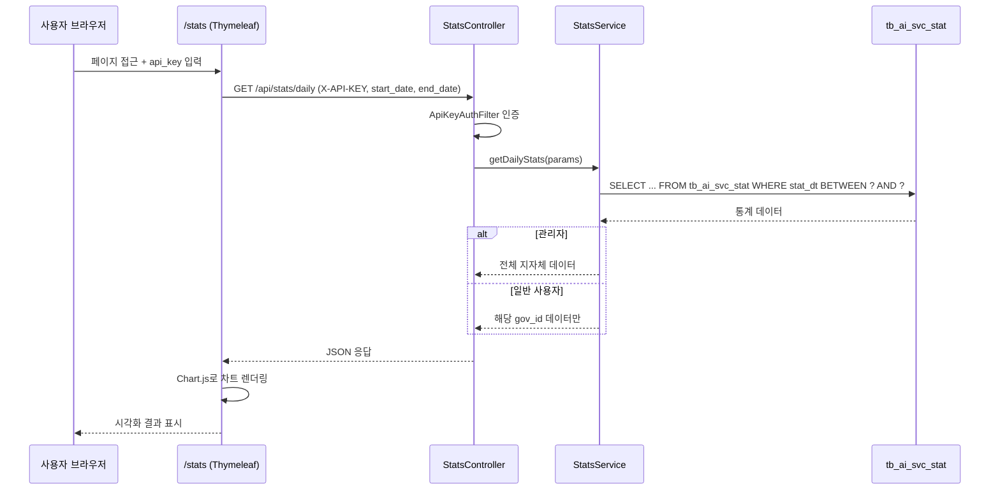

# AI 호출 통계 웹페이지 기획안 (AI Call Statistics Page)

본 문서는 AI Cast 시스템의 Azure AI 호출 통계 조회 웹페이지(WEB-02, `/stats`) 구현 계획을 정의합니다.

---

## 1. 개요

### 1.1. 목적
Azure AI 서비스(STT, NLP, TRANSLATE, OCR, IMAGE_GEN) 호출 통계를 일별/주별/월별로 시각화하여 서비스 사용량과 비용을 분석할 수 있는 웹페이지를 제공합니다.

### 1.2. 요구사항 매핑

| 요구사항 | 설명 |
|:---:|:---|
| **F-12** | 일별, 주별, 월별 호출 통계 조회 웹페이지 구축 |
| **F-13** | 관리자: 전체 조회 / 일반: 자신의 api_key 통계만 조회 |

### 1.3. 연동 API

| API ID | Endpoint | 용도 |
|:---:|:---|:---|
| API-06 | `GET /api/stats/daily` | 일별 통계 데이터 조회 |
| API-07 | `GET /api/stats/weekly` | 주별 통계 데이터 조회 |
| API-08 | `GET /api/stats/monthly` | 월별 통계 데이터 조회 |

### 1.4. 데이터 소스

| 테이블 | 용도 |
|:---|:---|
| `tb_ai_svc_stat` | 일별 집계 통계 (매일 00:10 자동 생성) |
| `gov_list` | 호출자(지자체) 정보 (참조 전용) |

---

## 2. 사용자 유형 및 권한

| 유형 | 접근 방식 | 조회 범위 |
|:---|:---|:---|
| **관리자** | 관리자 api_key로 인증 | 전체 지자체 통계 조회 가능 |
| **일반 사용자** | 자신의 api_key로 인증 | 자신의 api_key 통계만 조회 |

### 2.1. 인증 흐름

```
[페이지 접근] → [api_key 입력] → [API-06~08 호출 시 X-API-KEY 헤더 포함]
                                   → 관리자: 전체 데이터 반환
                                   → 일반: 해당 api_key 데이터만 반환
```

---

## 3. 페이지 구성

### 3.1. 전체 레이아웃

```
┌──────────────────────────────────────────────────────┐
│  📊 AI 호출 통계                    [api_key 입력]    │
├──────────────────────────────────────────────────────┤
│  [일별]  [주별]  [월별]          기간선택 📅           │
├──────────────────────────────────────────────────────┤
│  ┌─────────┐ ┌─────────┐ ┌─────────┐ ┌─────────┐    │
│  │총 호출수 │ │ 성공수  │ │ 실패수  │ │ 성공률  │    │
│  │  4,520  │ │  4,480  │ │   40    │ │ 99.1%   │    │
│  └─────────┘ └─────────┘ └─────────┘ └─────────┘    │
├──────────────────────────────────────────────────────┤
│          호출 추이 차트 (Line Chart)                   │
│  ┌──────────────────────────────────────────────┐    │
│  │  📈 일별 호출 수 추이                          │    │
│  │       (STT / NLP / TRANSLATE / OCR / IMG)     │    │
│  └──────────────────────────────────────────────┘    │
├──────────────────────────────────────────────────────┤
│  ┌──────────────────────┐ ┌──────────────────────┐   │
│  │  서비스별 비율         │ │  성공/실패 비율        │   │
│  │  (Doughnut Chart)    │ │  (Doughnut Chart)    │   │
│  └──────────────────────┘ └──────────────────────┘   │
├──────────────────────────────────────────────────────┤
│  ┌──────────────────────────────────────────────┐    │
│  │  평균 처리시간 차트 (Bar Chart)                 │    │
│  │  STT: ██████ 2340ms                           │    │
│  │  NLP: ████ 1520ms                             │    │
│  │  TRANSLATE: ██ 430ms                           │    │
│  │  OCR: ███ 890ms                               │    │
│  │  IMAGE_GEN: █ 280ms                           │    │
│  └──────────────────────────────────────────────┘    │
├──────────────────────────────────────────────────────┤
│  ┌──────────────────────────────────────────────┐    │
│  │  상세 통계 테이블 (DataTable)                   │    │
│  │  날짜 | 서비스 | 호출수 | 성공 | 실패 | 평균ms  │    │
│  │  ─────────────────────────────────────────    │    │
│  │  ...                                          │    │
│  └──────────────────────────────────────────────┘    │
└──────────────────────────────────────────────────────┘
```

### 3.2. 컴포넌트 상세

#### A. 상단 네비게이션

| 요소 | 설명 |
|:---|:---|
| 페이지 타이틀 | "📊 AI 호출 통계" |
| API Key 입력 | 텍스트 입력 + 인증 버튼, 인증 후 사용자명 표시 |
| 대시보드 링크 | `/dashboard` 이동 버튼 (관리자만 표시) |

#### B. 기간 선택 영역

| 요소 | 설명 |
|:---|:---|
| 탭 전환 | `일별` / `주별` / `월별` 3개 탭 |
| 날짜 선택 | DatePicker (일별: 시작~종료, 주별: 연도+주차, 월별: 연도+월) |
| 서비스 필터 | 드롭다운 (전체 / STT / NLP / TRANSLATE / OCR / IMAGE_GEN) |
| 지자체 필터 | 드롭다운 (관리자만 표시, 전체 / 개별 지자체 선택) |

#### C. 요약 카드 (Summary Tiles)

| 카드 | 데이터 | 색상 |
|:---|:---|:---|
| 총 호출수 | `SUM(tot_cnt)` | Blue |
| 성공수 | `SUM(ok_cnt)` | Green |
| 실패수 | `SUM(fail_cnt)` | Red |
| 성공률 | `ok_cnt / tot_cnt * 100` | Green/Yellow/Red (구간별) |

#### D. 호출 추이 차트 (Line Chart)

| 항목 | 설명 |
|:---|:---|
| 차트 유형 | 다중 선 그래프 (Multi-Line Chart) |
| X축 | 날짜 (일별 기준) |
| Y축 | 호출 수 |
| 시리즈 | 서비스별 5개 라인 (STT, NLP, TRANSLATE, OCR, IMAGE_GEN) |
| 인터랙션 | 마우스 hover 시 툴팁, 시리즈 토글 |

#### E. 서비스별 / 성공실패 비율 (Doughnut Chart)

| 차트 | 데이터 |
|:---|:---|
| 서비스별 비율 | 각 svc_type의 tot_cnt 비율 |
| 성공/실패 비율 | 전체 ok_cnt vs fail_cnt |

#### F. 평균 처리시간 (Bar Chart)

| 항목 | 설명 |
|:---|:---|
| 차트 유형 | 수평 Bar Chart |
| 항목 | 서비스별 `avg_ms` |
| 색상 | 서비스별 고유 색상 |

#### G. 상세 통계 테이블 (DataTable)

| 컬럼 | 데이터 |
|:---|:---|
| 날짜 | `stat_dt` |
| 지자체 | `gov_name` (관리자만 표시) |
| 서비스 | `svc_type` |
| 총 호출 | `tot_cnt` |
| 성공 | `ok_cnt` |
| 실패 | `fail_cnt` |
| 성공률 | 계산값 (%) |
| 평균 처리시간 | `avg_ms` (ms) |

- 페이징: 20건/페이지
- 정렬: 컬럼 헤더 클릭 정렬
- 내보내기: CSV 다운로드 버튼

---

## 4. 기술 스택

| 항목 | 선택 | 비고 |
|:---|:---|:---|
| **렌더링** | Spring Boot Thymeleaf (SSR) | 백엔드 통합, 별도 프론트 서버 불필요 |
| **차트 라이브러리** | Chart.js | 경량, 반응형, 다양한 차트 유형 지원 |
| **CSS 프레임워크** | Bootstrap 5 | 반응형 레이아웃, Dark Mode 지원 |
| **날짜 선택** | Flatpickr | 경량 DatePicker |
| **테이블** | DataTables.js | 정렬, 페이징, CSV 내보내기 |
| **HTTP 통신** | Fetch API | 탭/필터 변경 시 비동기 데이터 갱신 |

---

## 5. 데이터 흐름



---

## 6. API 호출 파라미터 정리

### 6.1. 일별 조회 (API-06)
```
GET /api/stats/daily?start_date=2026-05-01&end_date=2026-05-11&svc_type=STT
Headers: X-API-KEY: {api_key}
```

### 6.2. 주별 조회 (API-07)
```
GET /api/stats/weekly?year=2026&week=20&svc_type=
Headers: X-API-KEY: {api_key}
```

### 6.3. 월별 조회 (API-08)
```
GET /api/stats/monthly?year=2026&month=5&svc_type=
Headers: X-API-KEY: {api_key}
```

---

## 7. UI 인터랙션 상세

### 7.1. 탭 전환 동작

| 탭 | API 호출 | 날짜 UI 변경 |
|:---|:---|:---|
| 일별 | API-06 (`/api/stats/daily`) | DateRange Picker (시작~종료) |
| 주별 | API-07 (`/api/stats/weekly`) | 연도 + 주차 선택 |
| 월별 | API-08 (`/api/stats/monthly`) | 연도 + 월 선택 |

### 7.2. 필터 변경 시 동작
1. 서비스 필터 / 지자체 필터 / 기간 변경
2. Fetch API로 해당 API 비동기 호출
3. 응답 데이터로 모든 차트 + 카드 + 테이블 동시 갱신
4. 로딩 스피너 표시 → 데이터 수신 후 해제

### 7.3. 테이블 CSV 내보내기
- DataTables.js `buttons` 확장 활용
- 현재 필터/기간 조건 데이터를 CSV로 다운로드

---

## 8. 디자인 스타일

| 항목 | 설정 |
|:---|:---|
| 테마 | **Dark Mode** (기존 Dashboard과 통일) |
| 배경 | `#1a1a2e` (진한 남색) |
| 카드 | Glassmorphism 효과, `rgba(255,255,255,0.05)` 배경 |
| 차트 색상 | STT: `#3498db`, NLP: `#2ecc71`, TRANSLATE: `#e74c3c`, OCR: `#f39c12`, IMAGE_GEN: `#9b59b6` |
| 폰트 | Google Fonts `Inter` |
| 성공률 색상 | ≥95%: Green, ≥80%: Yellow, <80%: Red |

---

## 9. 파일 구조 (구현 예정)

```text
src/main/resources/
├── templates/
│   └── stats.html              # Thymeleaf 통계 페이지
├── static/
│   ├── css/
│   │   └── stats.css           # 통계 페이지 전용 스타일
│   └── js/
│       └── stats.js            # 차트 렌더링 및 API 호출 로직
```

---

## 10. 구현 순서

| 단계 | 작업 | 산출물 |
|:---:|:---|:---|
| 1 | StatsController 구현 (API-06~08) | `StatsController.java` |
| 2 | StatsService 구현 (조회 로직) | `StatsService.java` |
| 3 | TbAiSvcStatRepository 쿼리 구현 | `TbAiSvcStatRepository.java` |
| 4 | Thymeleaf 페이지 레이아웃 구현 | `stats.html` |
| 5 | Chart.js 차트 렌더링 구현 | `stats.js` |
| 6 | Dark Mode 스타일링 | `stats.css` |
| 7 | 권한별 조회 분기 로직 | `StatsService.java` (F-13) |
| 8 | CSV 내보내기 기능 | `stats.js` (DataTables) |
| 9 | 통합 테스트 | 관리자/일반 시나리오 검증 |

---
**최종 업데이트**: 2026-05-12
**참조 설계 문서**: DS_01_DB_Scheme.md (tb_ai_svc_stat), DS_02_API_List.md (API-06~08, WEB-02), DS_03_API_Specification.md (§3), DS_04_Class_Design.md (StatsController, StatsService)
